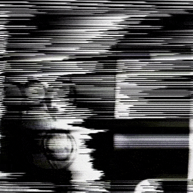

During my time as an MFA student at <a target="_blank" href="https://saic.edu">SAIC</a> in the <a target="_blank" href="https://www.saic.edu/academics/departments/art-and-technology-studies">Art and Technology Studies</a> department, I had the priviledge of experimenting with the Sandin Image Processor (SIP), an analog video synthesizer from the 1970s, invented by Dan Sandin. There is a history of how more than one copy ended up in one of the school buildings, and how this synth is placed in the timeline of analog video synthesis, but I will leave that as a possible future blog post for another time. The purpose of this post, is to document what I have learned from my time alone with this synth.

Before coming to the school, I had heard about the Sandin Image Processor as being an inspiration for a tool I used called <a target="_blank" href="https://hydra.ojack.xyz">Hydra</a>, a browser-based open source software that turns written javascript into generated visuals. This was popular among the <a target="_blank" href="https://toplap.org/about/">livecoding</a> community, as an accessible way of supplementing sound or performances in general. Hydra also stands well on its own as an artist tool, being used in a variety of ways by video artists. I also use it for teaching certain programming concepts, showing how quickly one can make something happen with just a few functions.

Since Hydra is inspired by analog modular synthesis, we can also start thinking about concepts like modulation, inputs, and signal mixing.

<i style="color: #ccd3d5;">Computer camera modulated by an oscillator</i>

<i style="color: #ccd3d5;">Sandin camera as FM input for oscillator</i>

To get a sense of what people do with Hydra, you can view an an online gallery of hydra sketches in the form of a <a target="_blank" href="https://twitter.com/hydra_patterns">twitter bot</a> account.

Hydra uses shaders, which takes advantage of the architecture of the GPU. On the topic of video synthesis, whether it uses voltage or shader language, I will also be pulling in other examples that are present at the time I am writing this (Fall 2022). Here is a full list of the synths:

**Shaders**:  
  1) <a target="_blank" href="https://ojack.xyz/articles/hydra/index.html">Hydra</a> by Olivia Jack  
  2) <a target="_blank" href="https://www.kevinkripper.com/vsynth">VSynth</a> by Kevin Kripper  
  3) <a target="_blank" href="https://lumen-app.com/">Lumen</a> by Paracosm  

**Analog**:  
  1) Sandin Image Processor  
  2) Paik/Abe Video Synthesizer  

### The Hello World of Video Synthesis
In my opinion, the hello world for analog video synthesis, along with audio, should be the generation of an oscillator. The SIP has an oscillator module
