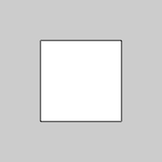
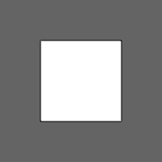
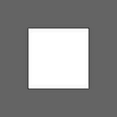
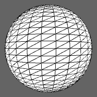
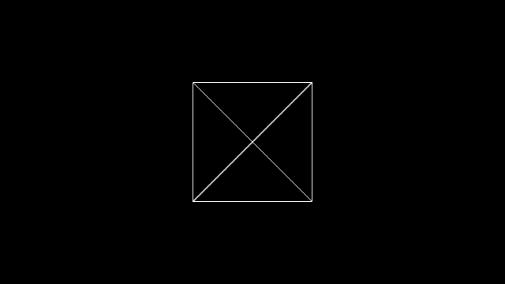
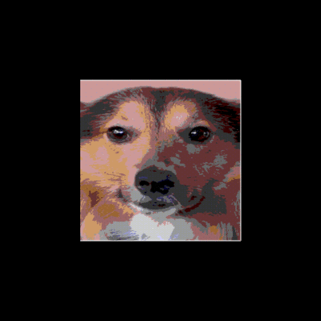

## P3D

To use the P3D renderer in your sketch:
```processing
// The size() function has an optional parameter to
// specify which renderer you want to use.
// There are two options besides the default -> P2D, P3D 

void setup() {
  size(200, 200, P3D);
}

void draw() {

}
```

### Intro
In Daniel Shiffman's Tutorial on the <a href="https://processing.org/tutorials/p3d/ ">Processing</a> website he provides some simple explanations and examples to get your head around drawing in 3D with Processing. Check those out if you need them.

Let's look at what happens if we try to draw a simple square at the center of the canvas like how we do in the default renderer and compare it with P3D:

<p style="text-align:center"> </p>
<p style="text-align:center">Default Renderer (left) vs. P3D (right)</p>

```processing
void setup() {
  //size(200, 200);
  size(200, 200, P3D);
}

void draw() {
  rectMode(CENTER);
  rect(0, 0, width/2, height/2);
}
```

don't be fooled, because a little more code will reveal that we are actually looking at the square in three dimensions. In P3D, we now have a Z axis to work with. To move the shape around this three dimensional space, we depend on the `translate()` function.

For example, we can make the square move towards us by incrementing the Z axis:
```processing
// example borrowed from https://processing.org/tutorials/p3d/

float x, y, z;

void setup() {
  size(200, 200, P3D);
  x = width/2;
  y = height/2;
  z = 0;
}

void draw() {
  translate(x,y,z);  
  rectMode(CENTER);
  rect(0,0,100,100);
  
  z++; // the rect moves forward.
}
```

<p style="text-align:center">

</p>

If you attempt to run this code in the default renderer or P2D, it will throw back an error at you.

By using `rotate()` you can _really_ see the 3D:
```processing
// Example with rotateX() uncommented.
float angle = 0;

void setup() {
  size(200, 200, P3D);
}

void draw() {
  background(100);
  rotateX(angle);
  // rotateY(angle);
  // rotateZ(angle);
  rectMode(CENTER);
  rect(width/2, height/2, 100, 100);
  angle+=0.03;
}
```

<p class="uk-text-center"> 
 
</p>

<p style="text-align:center">rotateX(angle) vs. rotateY(angle) vs. rotateZ(angle)</p>

You might have expected the square to rotate according to its center axis, but in P3D, it rotates according to the coordinate (`X`:0, `Y`:0, `Z`:0). To change this, we must use the `translate()` function to change the origin to the center. Make sure to call the rotation after the translation has been made, otherwise you will not see a change.

```processing
// Example with rotateX() uncommented.
float angle = 0;

void setup() {
  size(200, 200, P3D);
}

void draw() {
  background(100);
  translate(width/2, height/2);
  rotateX(angle);
  // rotateY(angle);
  // rotateZ(angle);
  rectMode(CENTER);
  rect(0, 0, 100, 100);
  angle+=0.03;
} 
```

<p style="text-align:center">
 
 
</p>

<p style="text-align:center">X axis vs. Y axis vs. Z axis with translation to its center</p>

<p style="text-align:center">
 
</p>

### 3D Shapes
There are 3D primitives that can be easily drawn using some built in functions:

```processing
// Example with box() uncommented.
// box(size), box(width, height, dimension of the box in the z-dimension)
// sphere(radius)

float angle = 0;

void setup() {
  size(200, 200, P3D);
}

void draw() {
  background(100);
  translate(width/2, height/2);
  rotateX(angle);
  rotateY(angle);
  rotateZ(angle);
  box(80);
  //sphere(80);
  
  angle+=0.03;
}
```

<p style="text-align:center">
 
 
</p>

<p style="text-align:center">`box()` and `sphere()`</p>

You can also draw custom shapes using `beginShape()`.

```processing
// example borrowed from https://processing.org/tutorials/p3d/

float angle = 0;

void setup() {
  size(640, 360, P3D); 
  stroke(255);
  noFill();
}

void draw() {
  background(0);
  translate(width/2, height/2, 0);

  rotateX(angle);
  rotateY(angle);

  beginShape();
  vertex(-100, -100, -100);
  vertex( 100, -100, -100);
  vertex(   0,    0,  100);

  vertex( 100, -100, -100);
  vertex( 100,  100, -100);
  vertex(   0,    0,  100);

  vertex( 100, 100, -100);
  vertex(-100, 100, -100);
  vertex(   0,   0,  100);

  vertex(-100,  100, -100);
  vertex(-100, -100, -100);
  vertex(   0,    0,  100);
  endShape();

  angle+=0.03;
}
```

<p style="text-align:center">
 
</p>

### Textures 

To add an image as a texture to a 3D custom shape:
```processing
PImage img;
float angle = 0;

void setup() {
  size(640, 360, P3D);
  img = loadImage("woof.bmp"); // 240 * 320 pixels
}

void draw() {
  background(0);
  translate(width/2, height/2);
  
  rotateX(angle);
  stroke(255);
  fill(127);
  beginShape();
  texture(img);  // add texture after beginShape() and before vertex functions
  vertex(-100, -100, 0, 0, 0);
  vertex( 100, -100, 0, 240, 0);
  vertex( 100,  100, 0, 240, 320);
  vertex(-100,  100, 0, 0, 320);
  endShape();
  
  angle+=0.03;
} 
```
<p style="text-align:center">
 
</p>

Notice how there were two more parameters in the vertex function. When providing a texture, we can also specify a `u` and `v` value, as used in something called `UV mapping`.
